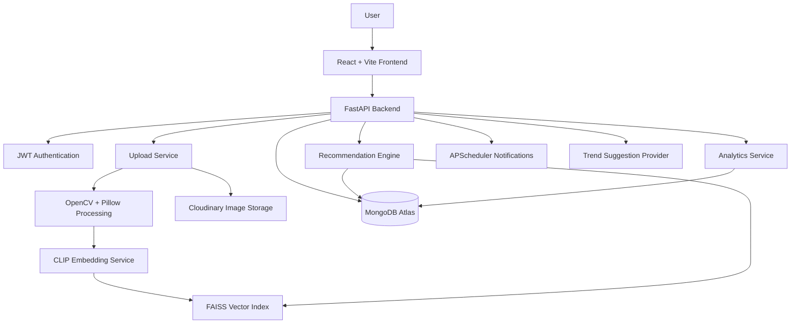
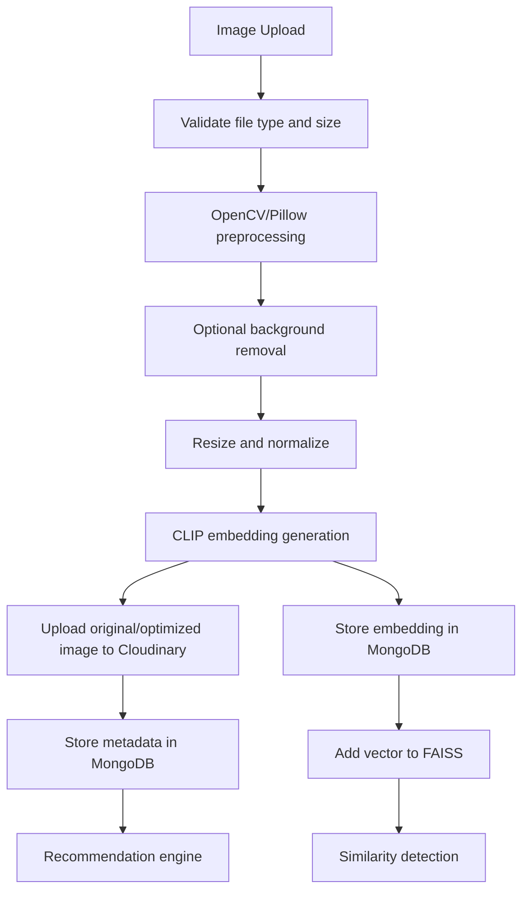
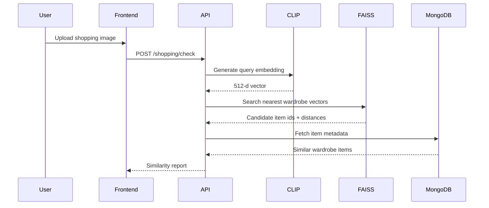
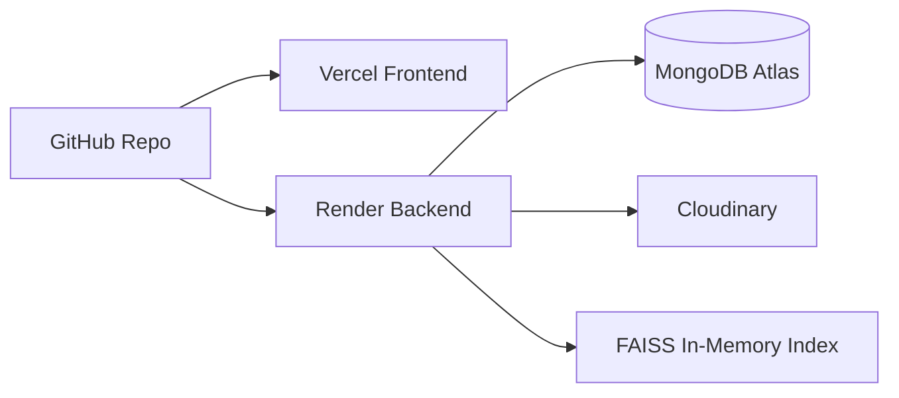

# StyleSync Software Architecture and Technical Design

Version: 1.0  
Date: August 4, 2026  
Project: Smart Dress Wardrobe and Personalized Dress Recommendation System

## 1. Executive Summary

StyleSync is an AI-assisted wardrobe management web application. Users upload clothing photos, the system extracts useful fashion metadata, stores the item in a digital wardrobe, and later compares shopping images against the wardrobe to prevent duplicate purchases. The same wardrobe data powers outfit recommendations, color matching, seasonal suggestions, occasion-based filtering, unused-clothing reminders, and analytics.

The recommended architecture is a **modular monolith**:

- One React frontend.
- One FastAPI backend split into clear modules.
- MongoDB Atlas for application data.
- Cloudinary for image storage.
- CLIP embeddings for visual similarity.
- FAISS for fast local vector search.
- Rule-based recommendation logic for the first production version.

This approach gives the team clean separation of concerns without the operational cost of microservices. It is suitable for a final-year B.Tech project because each module can be owned by a small subgroup, tested independently, and deployed on free or low-cost platforms.

## 2. Assumptions and Constraints

### Assumptions

- The first version supports individual users, not shared family wardrobes.
- Users upload normal clothing photos from phone cameras or shopping websites.
- The system focuses on dresses and common wardrobe items: tops, bottoms, outerwear, footwear, and accessories.
- The recommendation engine can begin with explainable rules and similarity scoring before moving to advanced personalization.
- FAISS can run inside the backend process for the prototype.

### Constraints

- Free-tier deployment should be possible, but free tiers change over time and often include limits on compute, storage, bandwidth, cold starts, or sleeping services.
- Render free web services may sleep when inactive, so first requests can be slow.
- If FAISS index files are stored only on an ephemeral filesystem, they can disappear after redeploys or restarts. The design therefore stores canonical embedding data in MongoDB and rebuilds the FAISS index at startup.
- CLIP gives strong general image embeddings, but it does not reliably classify domain-specific attributes such as exact fabric or sleeve type without additional rules or fine-tuning.

## 3. Architecture Recommendation

### Recommended Style: Modular Monolith

StyleSync should use a modular monolith for the first production-ready version.

| Option | Fit for StyleSync | Advantages | Drawbacks |
|---|---:|---|---|
| Simple monolith | Medium | Fastest to build, few moving parts | Can become messy as AI, recommendations, auth, and uploads grow |
| Modular monolith | High | Clear boundaries, easy deployment, realistic for a student team | Requires discipline around module boundaries |
| Microservices | Low for v1 | Independent scaling of AI and API services | Too much deployment, networking, auth, and debugging overhead |

### Decision

Use a **single FastAPI application** with internal modules:

- `auth`
- `users`
- `wardrobe`
- `uploads`
- `ai`
- `similarity`
- `recommendations`
- `analytics`
- `notifications`

This gives the codebase the shape of a scalable system while keeping deployment simple. If the project grows later, the AI module can be extracted into a separate worker service without redesigning the whole product.

## 4. High-Level Architecture



ASCII view:

```text
User
  |
  v
React Frontend
  |
  v
FastAPI Backend
  |-- Auth Module -> JWT + password hashing
  |-- Upload Module -> validation -> image processing -> Cloudinary
  |-- AI Module -> CLIP embeddings -> FAISS index
  |-- Wardrobe Module -> MongoDB item records
  |-- Recommendation Module -> rules + similarity + color logic
  |-- Analytics Module -> usage, duplicates, category distribution
  |-- Notification Module -> long-unused reminders
```

## 5. Technology Stack

| Layer | Recommended Technology | Why It Fits | Trade-Off |
|---|---|---|---|
| Frontend | React + Vite | Fast development, component-based UI, easy deployment on Vercel/Netlify | Requires frontend state discipline |
| Styling | Tailwind CSS + shadcn/ui | Fast, consistent UI with accessible primitives | Team must avoid inconsistent custom styling |
| Backend | FastAPI | Python-native, strong typing, automatic OpenAPI docs, ideal for ML integration | Async/sync boundaries need care |
| Database | MongoDB Atlas | Flexible clothing metadata, quick iteration, free cluster option | Complex joins are weaker than SQL |
| Auth | JWT + bcrypt/Argon2 | Stateless auth, easy frontend integration | Token expiry and refresh flow must be handled carefully |
| Image Storage | Cloudinary | Upload transformations, CDN delivery, image optimization | Free tier storage/bandwidth limits |
| Image Processing | OpenCV + Pillow | Practical preprocessing, resizing, cropping, color extraction | Background removal may need extra model/library |
| AI Model | OpenAI CLIP via PyTorch | Strong image-text embedding model, works without training | Not perfect for exact attribute classification |
| Vector Search | FAISS | Fast similarity search for embeddings | Local index persistence needs careful handling |
| Scheduler | APScheduler | Simple in-process reminders for prototype | Not ideal for large-scale distributed scheduling |
| Deployment | Vercel + Render | Beginner-friendly free-tier path | Backend cold starts and resource limits |

## 6. Frontend Architecture

### Responsibilities

The frontend should own presentation and user interaction, not business logic. It should call backend APIs for all durable operations.

Recommended screens:

- Login and registration.
- Dashboard with wardrobe summary.
- Wardrobe grid with filters.
- Add clothing item.
- Item detail/edit page.
- Duplicate purchase check page.
- Outfit recommendations page.
- Analytics page.
- Profile/settings page.

### Suggested Structure

```text
frontend/
  src/
    app/
      router.tsx
      providers.tsx
    components/
      ui/
      wardrobe/
      recommendations/
      analytics/
    features/
      auth/
      wardrobe/
      duplicate-check/
      recommendations/
      analytics/
    lib/
      api-client.ts
      auth.ts
      constants.ts
      validators.ts
    hooks/
    types/
    pages/
```

### State Management

- Use React Query or TanStack Query for server state: wardrobe items, recommendations, analytics.
- Use local component state for forms and UI controls.
- Store access tokens carefully. For a student project, local storage is acceptable if XSS prevention is taken seriously. A more secure production setup would use HTTP-only cookies.

## 7. Backend Architecture

### Responsibilities

The backend owns authentication, validation, AI processing, database writes, similarity search, recommendation logic, and notification scheduling.

```text
backend/
  app/
    main.py
    core/
      config.py
      security.py
      database.py
      errors.py
    modules/
      auth/
      users/
      wardrobe/
      uploads/
      ai/
      similarity/
      recommendations/
      analytics/
      notifications/
    schemas/
    shared/
      cloudinary_client.py
      image_utils.py
      pagination.py
  tests/
```

### Layering

Each feature module should follow this pattern:

```text
router.py      -> HTTP endpoints
schemas.py     -> Pydantic request/response models
service.py     -> business logic
repository.py  -> database access
models.py      -> database document shape helpers
```

This keeps API handling separate from business logic and database code. It also makes testing easier because service functions can be tested without running the web server.

## 8. Database Design

MongoDB is a good fit because clothing attributes can vary by item type. A dress, jacket, shoe, and accessory do not all share the same fields.

### Collections

#### `users`

```json
{
  "_id": "ObjectId",
  "name": "Lakshya",
  "email": "user@example.com",
  "password_hash": "...",
  "created_at": "2026-08-04T10:00:00Z",
  "preferences": {
    "preferred_colors": ["navy", "white"],
    "style_tags": ["casual", "minimal"],
    "notification_enabled": true
  }
}
```

Indexes:

- Unique index on `email`.

#### `wardrobe_items`

```json
{
  "_id": "ObjectId",
  "user_id": "ObjectId",
  "name": "Blue floral dress",
  "image_url": "https://res.cloudinary.com/.../image.jpg",
  "cloudinary_public_id": "stylesync/users/123/item456",
  "type": "dress",
  "category": "one_piece",
  "primary_color": "blue",
  "secondary_colors": ["white", "green"],
  "pattern": "floral",
  "sleeve_type": "short_sleeve",
  "fabric": "cotton",
  "season": ["summer", "spring"],
  "occasion": ["casual", "day_out"],
  "tags": ["floral", "comfortable"],
  "last_worn_at": null,
  "wear_count": 0,
  "created_at": "2026-08-04T10:00:00Z",
  "updated_at": "2026-08-04T10:00:00Z"
}
```

Indexes:

- `{ user_id: 1, type: 1 }`
- `{ user_id: 1, primary_color: 1 }`
- `{ user_id: 1, occasion: 1 }`
- `{ user_id: 1, season: 1 }`
- `{ user_id: 1, last_worn_at: 1 }`

#### `item_embeddings`

```json
{
  "_id": "ObjectId",
  "user_id": "ObjectId",
  "item_id": "ObjectId",
  "model_name": "clip-vit-base-patch32",
  "embedding": [0.012, -0.031, 0.144],
  "embedding_dim": 512,
  "created_at": "2026-08-04T10:00:00Z"
}
```

Indexes:

- Unique index on `item_id`.
- Index on `user_id`.

Reasoning: MongoDB is the source of truth for embeddings. FAISS is a fast runtime index that can be rebuilt.

#### `outfit_logs`

```json
{
  "_id": "ObjectId",
  "user_id": "ObjectId",
  "item_ids": ["ObjectId", "ObjectId"],
  "occasion": "college",
  "worn_at": "2026-08-04T10:00:00Z",
  "rating": 4
}
```

#### `shopping_checks`

```json
{
  "_id": "ObjectId",
  "user_id": "ObjectId",
  "query_image_url": "https://res.cloudinary.com/.../query.jpg",
  "similar_items": [
    {
      "item_id": "ObjectId",
      "similarity": 0.87
    }
  ],
  "decision": "similar_found",
  "created_at": "2026-08-04T10:00:00Z"
}
```

## 9. AI Pipeline



### Pipeline Steps

1. Validate the file extension, MIME type, and size.
2. Convert the image to RGB.
3. Resize to the model input size while preserving aspect ratio where possible.
4. Optionally remove or reduce background noise.
5. Generate a CLIP image embedding.
6. Extract simple visual attributes:
   - Dominant colors from pixel clustering.
   - Pattern hints from classifier/rules.
   - Category/type from CLIP zero-shot prompts.
7. Upload image to Cloudinary.
8. Store metadata and embedding in MongoDB.
9. Insert vector into FAISS for fast similarity queries.

### Why CLIP

CLIP maps images and text into a shared embedding space. This helps StyleSync in two ways:

- Similar clothing images have nearby vectors, which supports duplicate detection.
- Image embeddings can be compared against text prompts such as "a floral summer dress" for zero-shot classification.

## 10. AI Model Selection

| Model | Strength | Weakness | Recommendation |
|---|---|---|---|
| CLIP | Excellent general-purpose image similarity and text-image matching | Not trained specifically for fashion taxonomy | Use for v1 |
| ResNet | Reliable feature extraction, lightweight options | Less semantic than CLIP for clothing descriptions | Backup embedding model |
| EfficientNet | Good accuracy/compute balance | Needs labeled fashion data for classification | Good future classifier |
| YOLO | Object detection and localization | Does not solve similarity by itself | Use later for detecting clothing regions |
| ViT | Strong image representation | Heavier and harder to deploy on free CPU | Future upgrade |
| MobileNet | Lightweight and fast | Lower representation quality | Useful for mobile/on-device experiments |

### Final Model Choice

Use **CLIP ViT-B/32** for the first version because it works without collecting a large labeled dataset. For exact fabric, sleeve, and pattern classification, combine CLIP zero-shot prompts with user-editable metadata rather than pretending the model will always be correct.

## 11. Similarity Detection

### Storage Strategy

- MongoDB stores the canonical vector for each item.
- FAISS stores an in-memory searchable index.
- On backend startup, load all embeddings from MongoDB and rebuild the FAISS index.

This avoids depending on persistent local disk, which can be fragile on free hosting.

### Similarity Flow



### Thresholds

Use cosine similarity after normalizing embeddings.

| Similarity Score | Meaning | User Message |
|---:|---|---|
| `>= 0.85` | Very similar | "You may already own something very close." |
| `0.70 - 0.84` | Somewhat similar | "This resembles a few wardrobe items." |
| `< 0.70` | Likely different | "No strong duplicate found." |

These thresholds should be tuned with real test images. The first evaluation set can contain 100 to 200 manually grouped clothing photos.

## 12. Recommendation Engine

The first version should use explainable hybrid recommendations:

- Rule-based filters for occasion, season, type compatibility, and color harmony.
- Similarity-based suggestions using CLIP vectors.
- Usage-based ranking to promote long-unused items.
- User preference boosts for favorite colors and styles.

### Outfit Scoring

```text
score =
  0.30 * occasion_match
+ 0.20 * color_compatibility
+ 0.15 * season_match
+ 0.15 * item_type_compatibility
+ 0.10 * underused_item_boost
+ 0.10 * user_preference_match
```

### Color Matching

Start with a practical rule table:

- Neutral colors match broadly: black, white, grey, beige, navy.
- Complementary pairs can be suggested carefully: blue-orange, red-green, purple-yellow.
- Analogous colors work for subtle outfits: blue-green, red-orange, yellow-green.
- Avoid more than three dominant colors in a single outfit recommendation.

### Common Mistake

Do not make the recommendation engine a black box in v1. Users trust suggestions more when the app can explain them, for example: "Recommended because it matches the occasion, season, and uses an item not worn recently."

## 13. REST API Design

Base URL:

```text
/api/v1
```

### Authentication

#### Register

```http
POST /api/v1/auth/register
Content-Type: application/json
```

```json
{
  "name": "Lakshya",
  "email": "user@example.com",
  "password": "StrongPass123!"
}
```

Response:

```json
{
  "user": {
    "id": "66b1...",
    "name": "Lakshya",
    "email": "user@example.com"
  },
  "access_token": "jwt-token",
  "token_type": "bearer"
}
```

#### Login

```http
POST /api/v1/auth/login
```

```json
{
  "email": "user@example.com",
  "password": "StrongPass123!"
}
```

### Wardrobe

#### Upload Item

```http
POST /api/v1/wardrobe/items
Authorization: Bearer <token>
Content-Type: multipart/form-data
```

Fields:

- `image`: file
- `name`: optional string
- `occasion`: optional string array
- `season`: optional string array

Response:

```json
{
  "id": "66b2...",
  "name": "Blue floral dress",
  "image_url": "https://res.cloudinary.com/.../dress.jpg",
  "type": "dress",
  "primary_color": "blue",
  "pattern": "floral",
  "season": ["summer"],
  "occasion": ["casual"],
  "confidence": {
    "type": 0.81,
    "color": 0.92,
    "pattern": 0.68
  }
}
```

#### List Items

```http
GET /api/v1/wardrobe/items?type=dress&color=blue&occasion=casual&page=1&page_size=20
```

#### Update Item

```http
PATCH /api/v1/wardrobe/items/{item_id}
```

```json
{
  "occasion": ["college", "casual"],
  "season": ["summer"],
  "fabric": "cotton"
}
```

#### Delete Item

```http
DELETE /api/v1/wardrobe/items/{item_id}
```

### Duplicate Purchase Check

```http
POST /api/v1/shopping/check
Authorization: Bearer <token>
Content-Type: multipart/form-data
```

Response:

```json
{
  "decision": "similar_found",
  "highest_similarity": 0.88,
  "similar_items": [
    {
      "id": "66b2...",
      "name": "Blue floral dress",
      "image_url": "https://res.cloudinary.com/.../dress.jpg",
      "similarity": 0.88,
      "reason": "Similar color, silhouette, and pattern."
    }
  ]
}
```

### Recommendations

```http
GET /api/v1/recommendations/outfits?occasion=college&season=summer
```

Response:

```json
{
  "recommendations": [
    {
      "items": [
        { "id": "top123", "name": "White cotton top" },
        { "id": "bottom456", "name": "Blue denim jeans" }
      ],
      "score": 0.84,
      "reasons": [
        "Matches summer season",
        "Neutral top works with blue bottom",
        "White cotton top has not been worn recently"
      ]
    }
  ]
}
```

### Analytics

```http
GET /api/v1/analytics/wardrobe
```

Response:

```json
{
  "total_items": 42,
  "most_common_color": "blue",
  "least_used_items": 6,
  "category_distribution": {
    "dress": 12,
    "top": 14,
    "bottom": 8,
    "footwear": 5,
    "accessory": 3
  }
}
```

## 14. End-to-End Workflows

### Add Wardrobe Item

1. User uploads clothing image.
2. Frontend sends multipart request to backend.
3. Backend validates file and user token.
4. Image is preprocessed.
5. CLIP generates embedding.
6. Attribute extraction predicts clothing metadata.
7. Image is uploaded to Cloudinary.
8. Metadata and embedding are stored in MongoDB.
9. FAISS index is updated.
10. Frontend displays the new item and editable predicted attributes.

### Check New Purchase

1. User uploads shopping image.
2. Backend creates embedding for the query image.
3. FAISS returns nearest wardrobe items for that user.
4. Backend applies threshold rules.
5. Similar items are returned with explanation.
6. User decides whether to buy or skip.

### Recommend Outfit

1. User selects occasion and season.
2. Backend filters wardrobe by available categories.
3. Recommendation service builds compatible combinations.
4. Each combination is scored.
5. Frontend displays ranked outfits with reasons.

## 15. Security Design

### Authentication

- Hash passwords using bcrypt or Argon2.
- Never store plain text passwords.
- Use short-lived JWT access tokens.
- Store user id in the token subject.
- Validate token on every protected endpoint.

### API Protection

- Validate all request bodies with Pydantic.
- Validate uploaded file type and size.
- Do not trust file extensions alone; inspect MIME type.
- Limit image dimensions before processing to prevent memory spikes.
- Use rate limiting on login and upload endpoints.
- Scope every database query by `user_id` to prevent cross-user data exposure.

### Frontend Security

- Escape user-provided text by relying on React rendering instead of raw HTML.
- Avoid `dangerouslySetInnerHTML`.
- Use environment variables for API URLs, not secrets.
- Do not expose Cloudinary API secret in the frontend.

### NoSQL Injection Prevention

- Never pass raw request objects directly into MongoDB queries.
- Build queries from whitelisted filter fields.
- Validate ids as ObjectId before querying.

### CSRF and XSS

If JWT is stored in local storage, CSRF risk is lower but XSS risk is higher. If JWT is stored in HTTP-only cookies, XSS impact is lower but CSRF protection is required. For v1, local storage is acceptable only with strict XSS hygiene. For production, prefer HTTP-only secure cookies plus CSRF tokens.

## 16. Deployment Design



### Frontend: Vercel or Netlify

- Build command: `npm run build`
- Output directory: `dist`
- Environment variable: `VITE_API_BASE_URL`

### Backend: Render

- Runtime: Python
- Start command: `uvicorn app.main:app --host 0.0.0.0 --port $PORT`
- Environment variables:
  - `MONGODB_URI`
  - `JWT_SECRET`
  - `CLOUDINARY_CLOUD_NAME`
  - `CLOUDINARY_API_KEY`
  - `CLOUDINARY_API_SECRET`
  - `CLIP_MODEL_NAME`

### Database: MongoDB Atlas

- Use the free M0 cluster for prototype data.
- Create indexes early; do not wait until queries become slow.
- Restrict network access where practical.

### Image Storage: Cloudinary

- Store optimized uploaded images.
- Use folder naming by user id.
- Store Cloudinary public ids in MongoDB for deletion and cleanup.

### FAISS Deployment Note

For free-tier backend deployment, do not rely on local files as the only copy of the vector index. Rebuild FAISS from MongoDB embeddings during startup. For larger production systems, move vector search to a managed vector database or a separate persistent service.

## 17. CI/CD

Use GitHub Actions for basic checks:

```yaml
name: CI

on:
  pull_request:
  push:
    branches: [main]

jobs:
  backend:
    runs-on: ubuntu-latest
    steps:
      - uses: actions/checkout@v4
      - uses: actions/setup-python@v5
        with:
          python-version: "3.11"
      - run: pip install -r backend/requirements.txt
      - run: pytest backend/tests

  frontend:
    runs-on: ubuntu-latest
    steps:
      - uses: actions/checkout@v4
      - uses: actions/setup-node@v4
        with:
          node-version: "20"
      - run: npm ci
        working-directory: frontend
      - run: npm run build
        working-directory: frontend
```

## 18. Performance Optimization

### Backend

- Resize large images before model inference.
- Cache model instance at application startup instead of loading CLIP per request.
- Use background tasks for slow post-processing where possible.
- Paginate wardrobe item lists.
- Create MongoDB indexes for common filters.

### Frontend

- Lazy-load routes.
- Use optimized Cloudinary image URLs.
- Use skeleton loading states for image grids.
- Cache API responses with React Query.

### AI

- Normalize embeddings once before storing.
- Keep FAISS index per user or store a mapping from vector ids to item ids.
- Rebuild the FAISS index from MongoDB when the backend starts.
- Limit nearest-neighbor search to top `k`, usually `5` to `10`.

## 19. Testing Strategy

### Backend Tests

- Auth registration/login tests.
- Upload validation tests.
- Wardrobe CRUD tests.
- Recommendation scoring tests.
- Similarity threshold tests.
- Database repository tests with a test database or mocked repositories.

### Frontend Tests

- Form validation tests.
- Wardrobe grid rendering tests.
- Upload flow tests.
- Duplicate result display tests.

### AI Evaluation

Create a small evaluation dataset:

- 30 near-duplicate clothing pairs.
- 30 same-category but different-style pairs.
- 30 unrelated clothing pairs.
- 20 difficult cases with background clutter.

Track:

- Top-1 duplicate detection accuracy.
- False positive rate.
- False negative rate.
- Average inference time.

## 20. 12-Week Implementation Roadmap

| Week | Goal | Deliverables |
|---:|---|---|
| 1 | Requirements and setup | Final scope, repo setup, UI wireframes, API contract draft |
| 2 | Core frontend shell | Routing, layout, auth pages, dashboard skeleton |
| 3 | Backend foundation | FastAPI app, MongoDB connection, config, error handling |
| 4 | Authentication | Register, login, JWT protection, password hashing |
| 5 | Image upload | Cloudinary integration, validation, wardrobe item creation |
| 6 | Image preprocessing | OpenCV/Pillow pipeline, dominant color extraction |
| 7 | CLIP integration | Embedding generation, metadata predictions, MongoDB embedding storage |
| 8 | FAISS similarity | Index build, duplicate shopping check endpoint |
| 9 | Recommendation engine | Occasion, season, color, and usage-based outfit suggestions |
| 10 | Analytics and reminders | Wardrobe analytics, long-unused logic, APScheduler reminders |
| 11 | Testing and polish | Backend tests, frontend edge cases, loading/error states |
| 12 | Deployment and documentation | Vercel, Render, MongoDB Atlas, Cloudinary, demo script, final report |

## 21. Future Enhancements

- Fine-tune a fashion-specific classifier using a labeled dataset.
- Add object detection to crop clothing from busy backgrounds.
- Move vector search to a managed vector database for scale.
- Add calendar/weather-aware outfit recommendations.
- Add collaborative wardrobes for families.
- Add browser extension or mobile share flow for shopping sites.
- Add personalized trend recommendations based on user style history.
- Add explainable AI cards showing why metadata was predicted.

## 22. Final Architecture Decision

StyleSync should be built as a **React + FastAPI modular monolith** with MongoDB Atlas, Cloudinary, CLIP, FAISS, and a hybrid recommendation engine.

This design is strong for the project because it balances ambition with realism. The AI features are meaningful but not dependent on training a large custom model. The backend remains deployable as one service. The database design supports flexible fashion metadata. The recommendation logic is explainable enough for users and evaluators. Most importantly, the system can be completed by a final-year team in one semester without spending the entire project on infrastructure.

## 23. Source Notes

The deployment choices and free-tier assumptions should be checked again before final submission because cloud providers change limits. Useful official references:

- Vercel pricing and Hobby plan: https://vercel.com/pricing
- Render free instance and web service documentation: https://render.com/docs/free and https://render.com/docs/web-services
- MongoDB Atlas free cluster documentation: https://www.mongodb.com/docs/atlas/reference/free-shared-limitations/
- Cloudinary pricing/free plan: https://cloudinary.com/pricing
- FAISS documentation: https://faiss.ai/
- FastAPI documentation: https://fastapi.tiangolo.com/
- React documentation: https://react.dev/
- Vite documentation: https://vite.dev/
